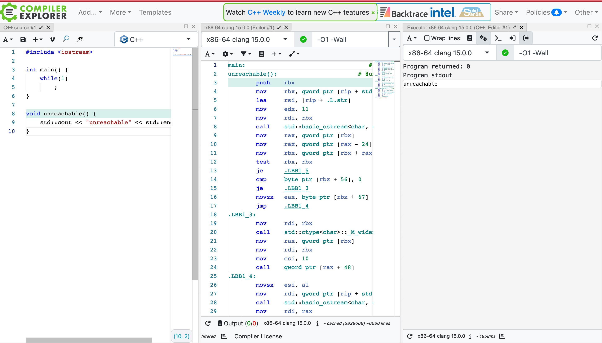

# Infinite Loop

## Is infinite loop undefined behavior?

I saw this interesting meme in QQ Zone:

I tested in [Godbolt](https://www.godbolt.org) and got exactly the same result:

At the first glance, I thought this would be a bug for compiler since optimizing away a infinite loop is somewhat unacceptable and I usually use `while(1);` to construct **TLE** in OnlineJudge.

However, according to [standard Basics.Program execution.Multi-threaded executions and data races.Forward progress](https://eel.is/c++draft/intro.progress), it seems to be an UB.

"the compiler may assume X about the program" is logically equivalent to "if the program doesn't satisfy X, the behaviour is undefined", so we should believe that an infinite loop without doing anything at all is an UB.

Here explains why this is UB: [N1528](https://www.open-std.org/jtc1/sc22/wg14/www/docs/n1528.htm)
